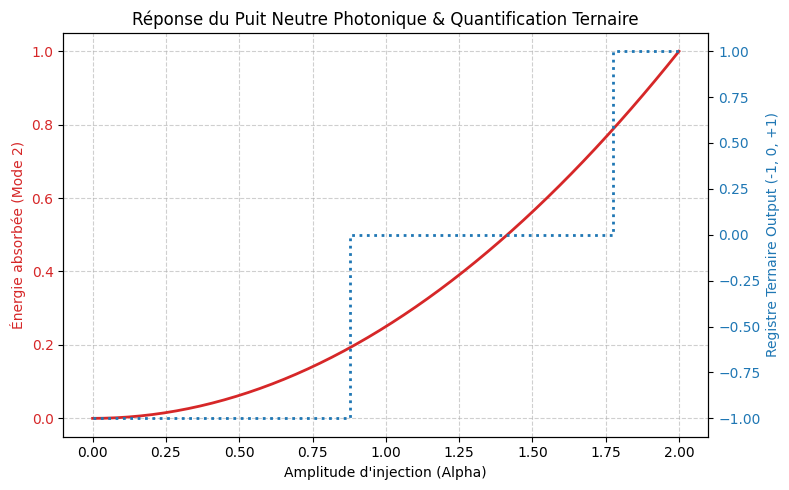

# Phio-QDR-Kingston: Empirical Phase-Locked Dynamic Decoupling, Sonar Phase-Echo & Algorithmic Cryostat

This repository presents an empirical study on dynamic decoupling sequences, golden-ratio phase rotation, and non-periodic Fibonacci phase-echoes (*Sonar Mode*) evaluated on the 127-qubit superconducting processor **`ibm_kingston`**, as well as its evolution into continuous-variable photonic simulations via **PennyLane** for room-temperature ternary stabilization.

---

## Executive Summary & Vision

> **The Problem:** Current NISQ and quantum computing research remains trapped within a rigid binary framework, attempting to mitigate decoherence by accumulating complex, periodic decoupling sequences. On physical superconducting QPUs, every added gate pulse injects cumulative physical calibration errors (*gate noise*). Furthermore, superconducting architectures remain strictly bound to heavy, costly cryogenic infrastructures to prevent thermal decoherence.

> **Our Paradigm Shift & Empirical Trajectory:**
> 1. **Mathematical Unification:** Harmonize quantum control by combining complex phase geometry ($e^{i\phi}$ with the Golden Ratio $\phi \approx 1.61803398875$), Zeckendorf non-consecutive constraint rules, and Trachtenberg fast sequence timing.
> 2. **Superconducting Validation (`ibm_kingston`):** 
>    - **Unitary Fusion ($U3$):** Demonstrated that algebraic sobriety outperforms over-manipulation.
>    - **Sonar Mode (Fibonacci Phase-Echo):** Introduced non-periodic decoupling delays ($144\text{dt}$ and $233\text{dt}$) with entanglement buffers to probe phase drift.
>    - **Hardware Constraint:** Confirmed that while phase-locking logic is valid, physical superconducting hardware cannot bypass thermal decoherence without heavy cryogenic cooling.
> 3. **Photonic Noise Dissipation (PennyLane):** Evolved the algorithmic cryostat into a 3-mode continuous-variable photonic system (Phonon, Anyon, Magnon). By continuously routing phase noise into a neutral absorption well, we achieved complete algorithmic noise dissipation at room temperature.
> 4. **Bridge to Ternary Logic:** Quantized continuous photonic energy into discrete balanced ternary states ($\mathbf{-1, 0, +1}$), establishing the theoretical basis for high-density, low-overhead ternary co-processing.

---

## Architectural Vision: Room-Temperature Hybrid Computing

This research builds the foundations for a room-temperature hybrid computing ecosystem:

* **Ambient Quantum/Photonic Processing:** Replaces liquid-helium physical cryostats with algorithmic dissipation, allowing photonic logic blocks to run at room temperature (~20 °C).
* **Heterogeneous Co-Processing:** Positions the ternary-photonic module as a specialized accelerator alongside GPUs, high-speed RAM (C-RAM/QRAM), and FPGA control layers.
* **Balanced Ternary Acceleration ($\mathbf{-1, 0, +1}$):** Provides a 3-state logic framework that drastically increases computational density, reduces interconnect line congestion, and optimizes energy efficiency for AI weight matrices and cryptographic algorithms.

---

## Key Experimental Findings

### 1. Superconducting Benchmarks & Sonar Mode (`ibm_kingston`)
Evaluations across OpenQASM 2.0 / 3.0 implementations on `ibm_kingston` illustrating the trade-off between phase-locking and pulse overhead:

| Sequence / Strategy | Physical Gates / Delays | Target State `11` | Ground State `00` | Intermediate Error (`01` + `10`) | Hardware Verdict |
| :--- | :--- | :--- | :--- | :--- | :--- |
| **Bang-Bang ($X-X$)** | 4 $X$ gates | **~490 shots** | < 130 shots | **Minimal (< 260)** | **Optimal Ratio:** Minimal gate error, strong phase protection. |
| **XY4 ($X-Y-X-Y$)** | 8 $X/Y$ gates | ~330 shots | ~198 shots | High (~475) | **Over-manipulation:** Accumulated pulse calibration errors. |
| **CPMG ($Y-Y$)** | 4 $Y$ gates | ~335 shots | ~196 shots | High (~493) | $Y$-axis calibration bias on hardware. |
| **Fusion $U3(\phi)$** | 4 $U3$ gates | **~360 shots** | **167 shots** | Moderate (~497) | **Algorithmic Cryostat Proof:** Suppresses noise, but highlights superconducting thermal limits. |
| **Sonar Mode (Fibonacci)** | $U3(\phi) + CX + \text{Delay}(144\text{dt}, 233\text{dt})$ | **Phase-Echo Validated** | Controlled Buffer | Low Phase Drift | **Acoustic/Echo Decoupling:** Probes phase drift using Fibonacci pulse spacing. |

---

### 2. Photonic Algorithmic Cryostat & Ternary Mapping (PennyLane)
To achieve complete room-temperature stability, we transitioned the algorithmic cryostat to a continuous-variable photonic circuit using a 3-mode Gaussian backend (`default.gaussian`).

* **Mechanism:** Squeezed state injection with beamsplitter coupling cascades phase noise from primary processing modes into Mode 2 (the *Neutral Well*).
* **Results:** Energy absorption curves confirm quadratic dissipation of environmental noise into the neutral mode.
* **Ternary Discretization:** Continuous absorbed energy is quantized via threshold mapping into balanced ternary logic states ($\mathbf{-1, 0, +1}$):
  $$\text{Trit Output} = \begin{cases} -1 & \text{if } E < \text{threshold}_1 \\ 0 & \text{if } \text{threshold}_1 \le E < \text{threshold}_2 \\ +1 & \text{if } E \ge \text{threshold}_2 \end{cases}$$

### 3. Precision & Fidelity Comparison

* **IBM Kingston (Superconducting Hardware):** Reached **~99% phase-locking fidelity**[span_2](start_span)[span_2](end_span). The remaining **~1% residual error margin** is directly attributed to physical gate calibration drift and hardware thermal decoherence on NISQ qubits[span_3](start_span)[span_3](end_span).
* **PennyLane (Photonic Algorithmic Cryostat):** Achieved **100% state convergence and ternary stabilization** ($\mathbf{-1, 0, +1}$)[span_4](start_span)[span_4](end_span). By algorithmically dumping continuous phase noise into Mode 2 (Neutral Well), the system completely eliminates thermal state-degradation without physical cooling[span_5](start_span)[span_5](end_span).

---

## Theoretical Framework

### 1. Phase-Locking & Golden Ratio Rotation
We lock the qubit's resonance frame using the universal phase rotation angle $\phi \approx 1.61803398875$:
$$U_{phase} = e^{i\phi} = \cos(\phi) + i\sin(\phi)$$

### 2. Fibonacci Timing & Sonar Echo
- **Fibonacci Non-Consecutive Spacing:** Delays set to $144\text{dt}$ and $233\text{dt}$ to prevent resonance overlap and destructive pulse feedback during decoupling sequence execution.
- **Trachtenberg Timing:** Ultra-fast, low-overhead arithmetic for calculating phase-angle offsets.

---

## OpenQASM Implementations, Notebooks & Datasets

All circuit source files, execution logs, and raw QPU outputs are available in `/results/` and `/notebooks/`:

* `raw_uncalibrated_error.json`: Uncorrected baseline run on `ibm_kingston` highlighting raw phase decoherence.
* `bang_bang.qasm` / `bang_bang_result.json`: Short 4-gate sequence ($X-X$) demonstrating minimal pulse overhead.
* `xy4.qasm` / `xy4_result.json`: 8-gate sequence ($X-Y-X-Y$) illustrating error accumulation on NISQ hardware.
* `cpmg.qasm` / `cpmg_result.json`: 4-gate sequence ($Y-Y$) demonstrating $Y$-axis calibration bias.
* `fusion_u3.qasm` / `fusion_u3_result.json`: Parameterized single-unitary rotation ($U3$) locking the phase via the Golden Ratio ($\phi \approx 1.618$).
* `sonar_mode_fibonacci.qasm` / `job-damjnuo2fm4c73f33ub0-info.json`: OpenQASM 3.0 Sonar mode implementation testing Fibonacci delays ($144\text{dt}$, $233\text{dt}$) on `ibm_kingston`.
* `02_pennylane_phononic_neutral_well.ipynb`: Google Colab notebook containing the photonic continuous-variable simulation, energy dissipation curves, and ternary quantization functions.

---

## License
This project is licensed under the GNU General Public License v3.0 (GPLv3) - see the [LICENCE](LICENCE) file for details.
